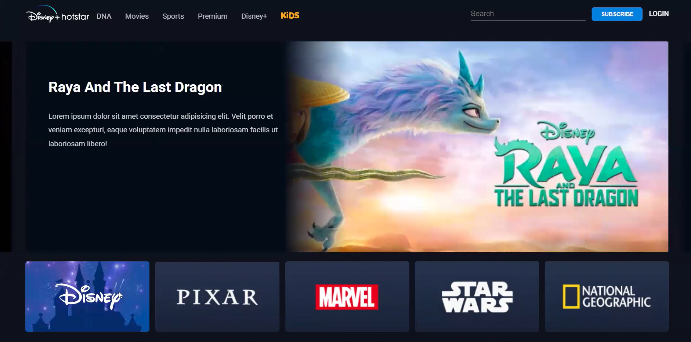
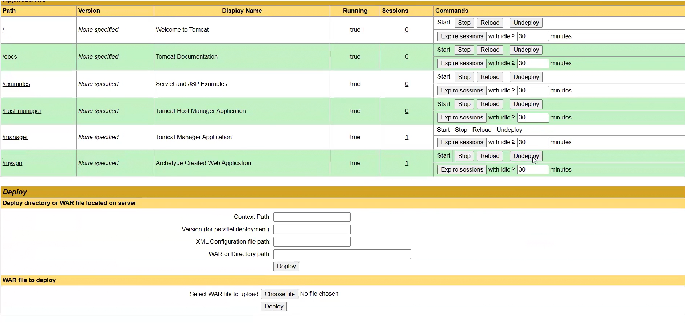

# Jenkins-ansible-ci-cd-pipeline
 CI/CD Pipeline using Jenkins and Ansible 

##  Project Overview
This project demonstrates a complete end-to-end CI/CD pipeline implemented using Jenkins and Ansible on AWS EC2. The pipeline automates the process of code integration, build, testing, artifact management, and deployment to a Tomcat server.

The main goal of this project is to achieve continuous integration and continuous deployment (CI/CD) by reducing manual intervention and improving deployment efficiency.

---

## ⚙️ CI/CD Pipeline Flow
GitHub → Jenkins → Maven Build → SonarQube Analysis → Artifact Storage (Nexus/S3) → Ansible → Tomcat Server Deployment

---

## Tools & Technologies Used
- Jenkins (CI/CD Automation)
- GitHub (Version Control)
- Maven (Build Tool)
- SonarQube (Code Quality Analysis)
- Nexus Repository / AWS S3 (Artifact Storage)
- Ansible (Configuration Management & Deployment)
- Apache Tomcat (Application Server)
- AWS EC2 (Infrastructure Hosting)
- Linux (Environment)

---

 ## Architecture

- Developer pushes code to GitHub
- Jenkins automatically triggers the pipeline
- Maven builds and tests the application
- SonarQube performs code quality checks
- Artifact is stored in Nexus/S3
- Ansible deploys application to Tomcat server on EC2

---

## Pipeline Stages

1. GitHub Checkout (Source Code)
2. Build using Maven
3. Run Unit Tests
4. SonarQube Code Analysis
5. Package Application (WAR file)
6. Upload Artifact to Nexus / S3
7. Deploy using Ansible Playbook
8. Restart Tomcat Server

---

##  Screenshots

### Application

### Deployment in Tomcat

---

##  Outcome
- Fully automated CI/CD pipeline from code commit to deployment
- Reduced manual deployment effort
- Improved build reliability and consistency
- Hands-on experience with DevOps tools and AWS services

---

##  Key Learnings
- CI/CD pipeline design and implementation
- Jenkins pipeline creation and automation
- Ansible-based deployment automation
- Maven build lifecycle
- Artifact management using Nexus/S3
- AWS EC2 deployment environment setup

---

##  Note
This project was built as part of hands-on learning in DevOps and Cloud Computing to understand real-world CI/CD workflows.

---

##  Author
Sanjeevan Varma  
GitHub: https://github.com/sanjeevanvarma  
LinkedIn: https://www.linkedin.com/in/sanjeevan-varma-indukuri-90943529b/
